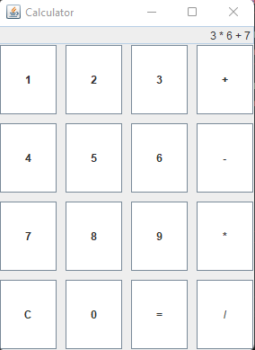
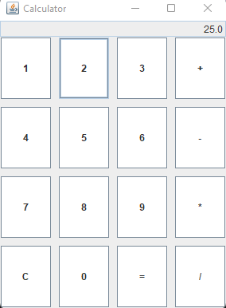

# SimpleSwingCalculator

## Introduction
Welcome to the **SimpleSwingCalculator**! This is a basic calculator application developed in Java using the Swing framework. It provides a simple and intuitive interface for performing basic arithmetic operations like addition, subtraction, multiplication, and division.

## Description
The **SimpleSwingCalculator** is a desktop application that replicates the functionality of a standard calculator. The application features a graphical user interface (GUI) created using Java Swing, making it easy to use and visually appealing. The calculator supports basic operations, allowing users to input expressions and compute results with ease. 

### Features:
- **Basic Arithmetic Operations**: Addition, Subtraction, Multiplication, and Division.
- **Clear Functionality**: Reset the input and start fresh.
- **Error Handling**: Displays "Error" in case of invalid operations, like division by zero.
- **User-Friendly Interface**: Easy-to-use button layout with responsive design.

## Explanation
The **SimpleSwingCalculator** is built around Java's Swing framework. The GUI consists of a main frame (`JFrame`), a text field (`JTextField`) for displaying the expression and result, and a grid of buttons (`JButton`) for user input.

### Key Components:
- **Text Field**: Displays the current expression and results.
- **Buttons**: Represent digits (0-9) and operations (+, -, *, /). The '=' button evaluates the expression, and 'C' clears the input.
- **Action Listener**: Each button is connected to an `ActionListener` that updates the expression or evaluates it.

### How it Works:
1. **Input**: Users enter numbers and operators by clicking the respective buttons.
2. **Expression Building**: The input is stored in a `StringBuilder` object that builds the expression as the user clicks buttons.
3. **Evaluation**: When the user clicks '=', the expression is evaluated by parsing and processing it.
4. **Result Display**: The result is displayed in the text field. If an error occurs (e.g., division by zero), an error message is shown.

## Conclusion
The **SimpleSwingCalculator** is a straightforward and effective tool for performing basic arithmetic calculations. Its clean and minimalistic design ensures that anyone can use it with ease. This project serves as a great example of building a simple yet functional GUI application in Java using Swing.

## Output

